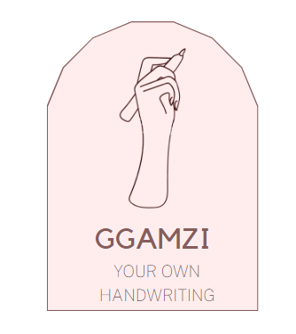

 

  

  <h3 align="center">GGAMZI-AI</h3>

  

    Generate texts with your own handwriting style!
    <!-- 
    <a href="https://github.com/othneildrew/Best-README-Template">View Demo</a>
    ·
    <a href="https://github.com/othneildrew/Best-README-Template/issues">Report Bug</a>
    ·
    <a href="https://github.com/othneildrew/Best-README-Template/issues">Request Feature</a>-->
  

## Project Info
* 고려대학교 딥러닝 학회 AIKU 2023년 2학기 프로젝트
* 개발 기간 : 2023.09 ~ 2023.12

## About The Project
* 깜지 AI는 개개인의 손 글씨 스타일을 모사하여 원하는 내용을 생성하는 FFG(Few-shot handwriting Font Generation) task 수행 모델입니다.

  
📌 Few-shot Font Generation Task 

  <ol>
    추가적인 fine tuning 없이, 적은 개수의 글자 모양(glyph)만으로 새로운 폰트를 생성해내는 task로, 글자 모양(content)의 global한 특징과 reference style의 local한 특징을 유지하는 것이 핵심입니다.
  </ol>

 
* 깜지를 대신 작성해주는 생성 모델을 만들어보자는 동기에서 시작하였습니다.
* 한글이 아닌, 한자나 중국어 데이터에 특화되어 있는 선행 모델들의 한계점을 해결하고자 했습니다.

## Modeling
* MX-Font (ICCV 2021)을 차용하였습니다. <a href="https://github.com/clovaai/mxfont">Link</a>

* **Training**
  * Dataset
    - 무료 폰트 사이트에서 수집한 약 312개의 폰트 파일(.ttf) <a href="https://noonnu.cc/#google_vignette">눈누</a>   <a href="https://www.ownglyph.com/notice">온글잎</a>   <a href="https://hangeul.naver.com/">한글한글 아름답게</a>
    - 공개되어 있는 필기체 데이터셋 및 직접 수집한 손글씨 이미지 데이터 (.png, .jpeg)   <a href="https://www.aihub.or.kr/aihubdata/data/view.do?currMenu=115&topMenu=100&aihubDataSe=realm&dataSetSn=71307">개인 특정을 위한 자필과 모사 필기체 데이터</a>
    
    _For more datasets that we used for training, please email us at kplove01@naver.com_

  * Methods
    - I2I(image-to-image) translation 방식으로 target domain에 맞도록 style을 transfer하면서 source domain의 content를 유지하는 매핑을 학습하는 방식입니다.
    - weak supervision으로 글자 구성 요소(component)를 학습하여 unseen data에 대한 성능을 올렸습니다
      - 여러 개의 인코더(multiple-headed experts)로 content와 style을 분리하여 학습합니다.
      - 최대 이분 매칭, 헝가리안 알고리즘을 활용하여 component-specific하게 훈련되는 것을 방지합니다.
    
* **Inference**
  * 입력 : Reference 이미지 4장, source language로 사용되는 글꼴, 생성하고 싶은 text 내용
 
## Contribution
 1. **Pretrained model이 한글의 여러 component 중 ㅇ,ㅎ 생성에 한계를 가진다는 점을 발견**
    
   → 여러 차례의 훈련을 진행하면서 <a href="#problem-with-training">발견되는 문제점</a>을 참고하여 체계적으로 한글 폰트 데이터를 라벨링하고 분류하여 해결
   
   
 2. **한글 데이터로 훈련하였을 때 발생한 문제점 및 해결 방식**
    
   - 한글에 존재하지 않는 component 생성
     - 원인 분석
       - 모델 구조 중 최대 이분 매칭 알고리즘을 한글에 적용하여 원인을 분석 → overfitting으로 결론
       - 훈련 데이터에서 사용한 글꼴마다 미세하게  다른 스타일
         - 자음 모음을 이어 쓰거나 붙여 쓰는 style이 동시에 섞이는 경우
         - 글꼴 스타일에 따라 다른 ㅎ,ㅊ 작성 방식
     - 해결 방식 
       - 여러 component로 분류될 여지가 있는 feature를 포함하는 특이한 데이터셋(out of distribution dataset)을 과감히 배제
       - 훈련 데이터의 다양성을 낮추어 학습
      
    - 스타일 반영도가 떨어짐
      - 원인 분석
        - 여러 ablation study와 experiment를 통해 확인하는 방식으로 진행
        - 여러 기준으로 데이터를 분류하여 experiment 진행 : 실제 손 글씨와 유사한 스타일, 곡선이 많은 스타일, 굵기, 기울기 등
      - 해결 방식 : 실제 손 글씨와 유사하고 곡선 위주의 데이터셋으로 훈련 시 style 반영도가 증가한다는 점을 발견 후 데이터셋을 재구성
       
     - 배경에 노이즈 포함
       - 해결 방식
         - 후처리 방식 고안 → morphological transformation, Alpha blending 기법 활용하여 해결
      

